# Tencent AI-NEXT 3D Face Model (East-Asian Version)

This folder provides the 3DMMs used in the following paper:

> **High-Fidelity 3D Digital Human Head Creation from RGB-D Selfies**.\
> Linchao Bao*, Xiangkai Lin*, Yajing Chen*, Haoxian Zhang*, Sheng Wang, Xuefei Zhe, Di Kang, Haozhi Huang, Xinwei Jiang, Jue Wang, Dong Yu, and Zhengyou Zhang. (*Equal contribution) \
> **ACM Transactions on Graphics 2021** \
> Project Page: https://tencent-ailab.github.io/hifi3dface_projpage/ \
> arXiv: https://arxiv.org/abs/2010.05562

**Note**: The 3DMM is for research purpose only. If you use the 3DMM provided in this folder, please cite our paper. For commercial uses, please contact [Linchao Bao](https://linchaobao.github.io/). 


## Download (5.4GB)
[Google Drive](https://drive.google.com/file/d/1vSb2EpduRJuIEUOc_aRsbjASSOUAk7tG/view?usp=sharing), or [**腾讯微云**](https://share.weiyun.com/ByrUzsJG)


## Description of **files** folder
- ***AI-NExT-Shape-NoAug.mat***: the shape basis constructed from our 200 East-Asian models with **only mirroring** augmentation, but without other augmentation schemes. The basis only keeps the dimensions with 99.9% cumulative explained variance after PCA, which is **257** in our case. 
- ***AI-NExT-Shape.mat***: the shape basis constructed with **all** augmentation schemes, which is the basis used in our paper. The dimension of the shape basis is **500**. The construction algorithm is described in our paper. 
- ***AI-NExT-Albedo-Global.mat***: the global albedo basis used in our 3DMM optimization for **facial geometry modeling**, which is constructed from our 200 albedo maps, augmented with mirroring and color augmentation, and preserved with 99.9% cumulative explained variance after PCA. The dimension is **294**. 
- ***AI-NExT-AlbedoNormal-RPB***: the regional pyramid bases (albedo and normal) used in our hybrid **facial reflectance synthesis** approach. Note that the basis dimension of each region is different from others. Again, only dimensions with 99.9% cumulative explained variance after PCA are preserved. 


## Description of **scripts** folder
It contains the example code for using the bases: 
- **test_basis_io.py**: the IO script to use all the bases
- **face.mtl**: material library for visualizing render results


## Usage
```python
python test_basis_io.py
```
The script randomly generates obj files / uv texture / uv normal.
To see how the UV is rendered with obj file, you may use **[meshlab](https://www.meshlab.net/)** to open **rand_shape.obj** in **scripts/**.


## Samples

The following list some samples from the bases. Note that the regional pyramid bases generate facial patches which are then combined into a whole UV map.

<div style="margin-bottom:20px; margin-top:20px">
<p>Randomly generated shape from <bold>AI-NExT-Shape.mat</bold></p>
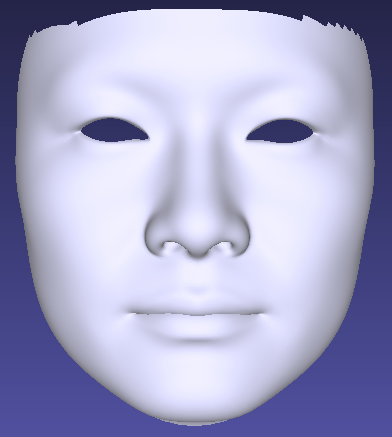
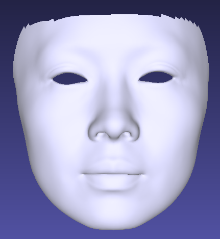
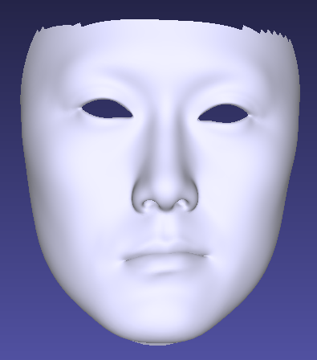
</div>

> Note: The randomly generated shape might be not symmetric, as the basis is designed to express asymmetric faces. 

<br>

<div style="margin-bottom:20px; margin-top:20px">
<p>Randomly generated global albedo UV from <bold>AI-NExT-Albedo-Global.mat</bold></p>
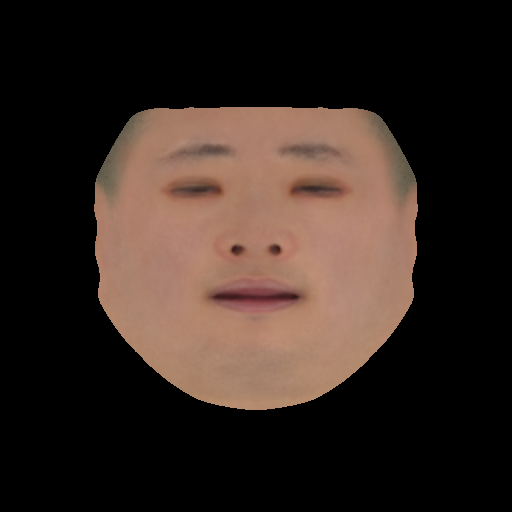
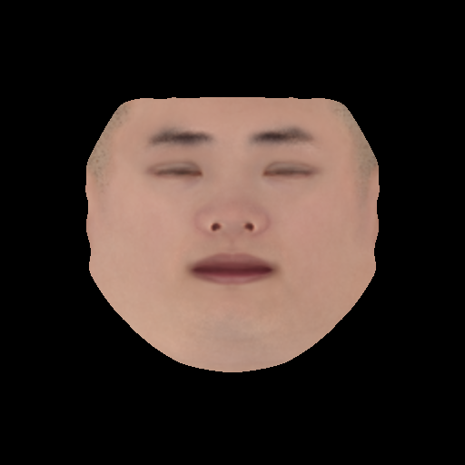
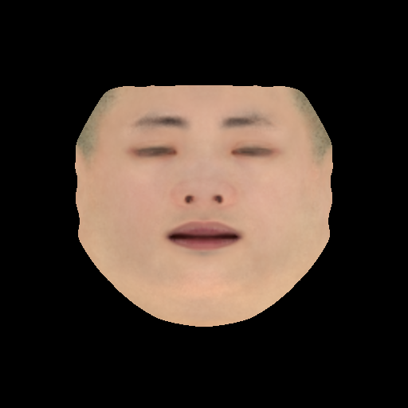
</div>

<br>

<div style="margin-bottom:20px; margin-top:20px">
<p>Randomly generated albedo and normal UV maps from <bold>AI-NExT-AlbedoNormal-RPB</bold></p>
<p>

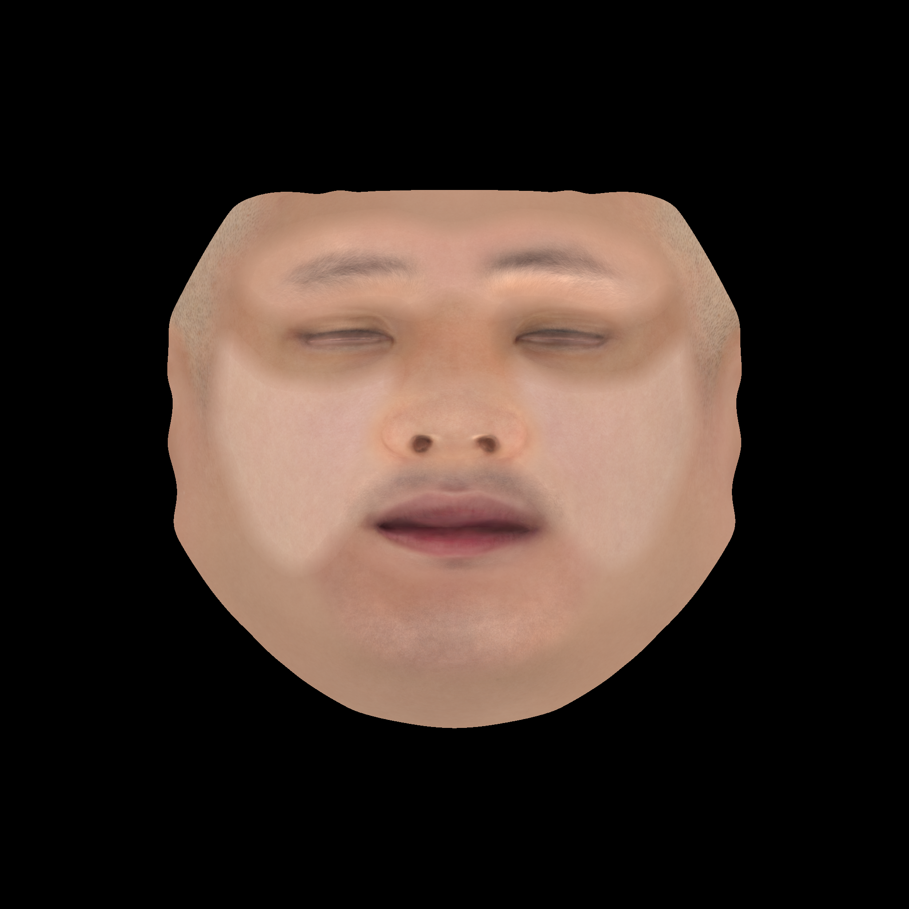
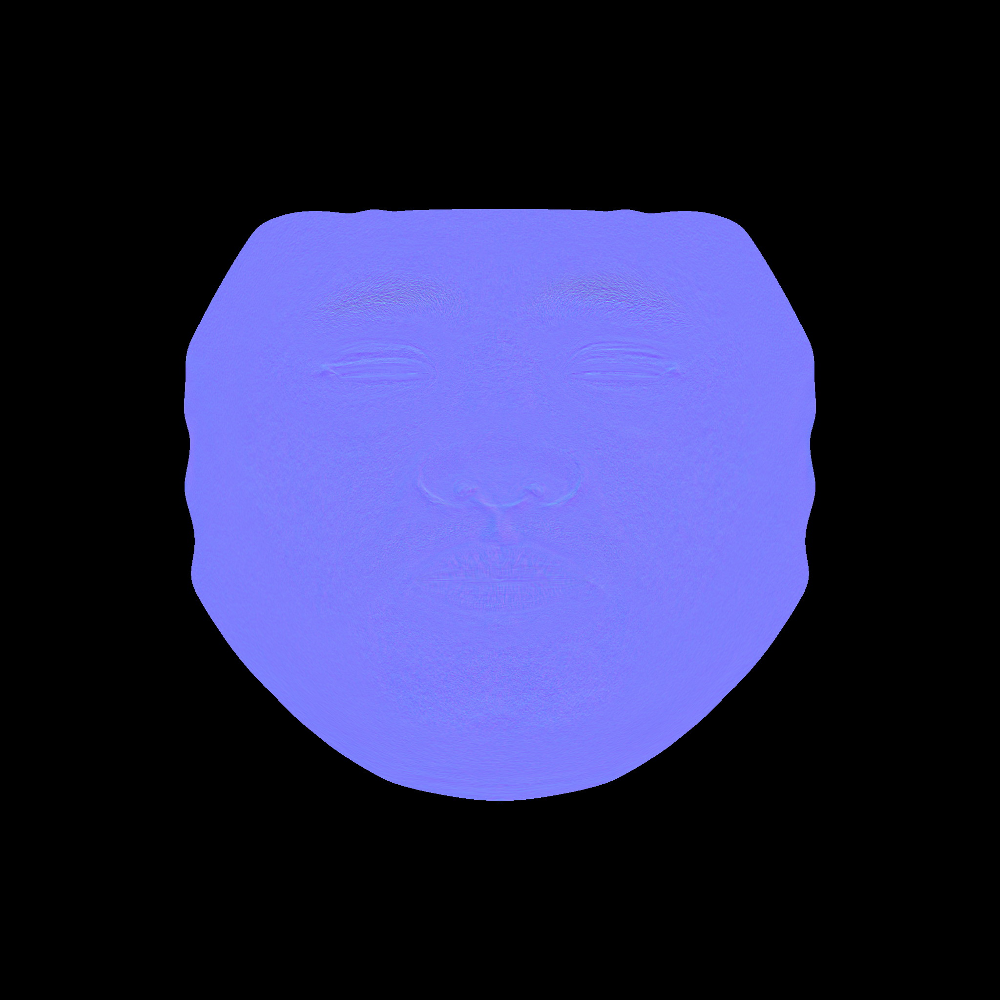
</p>
<p>
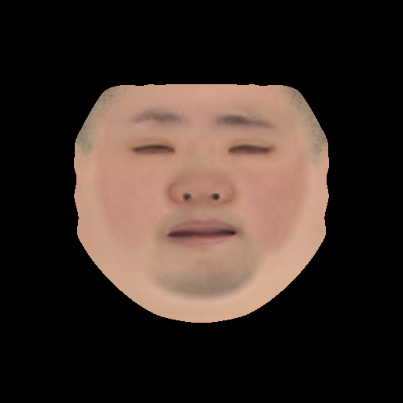

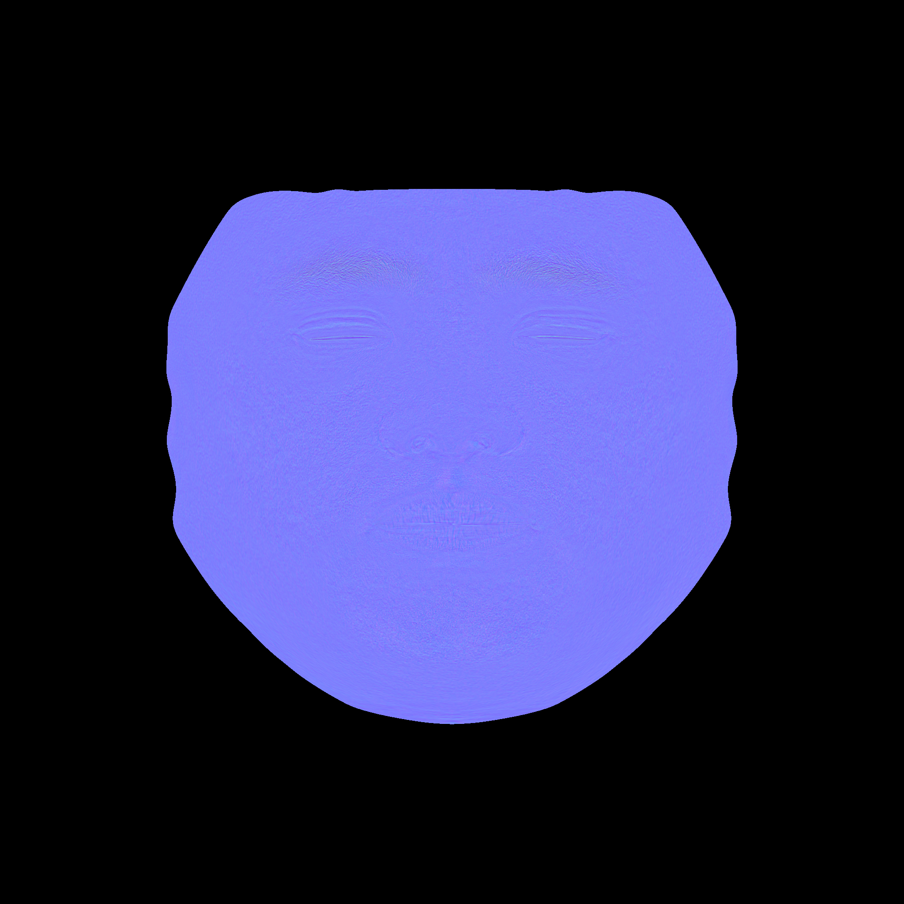
</p>
<p>
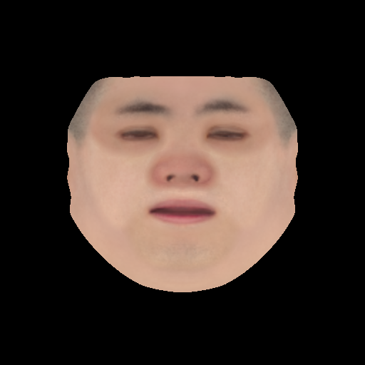
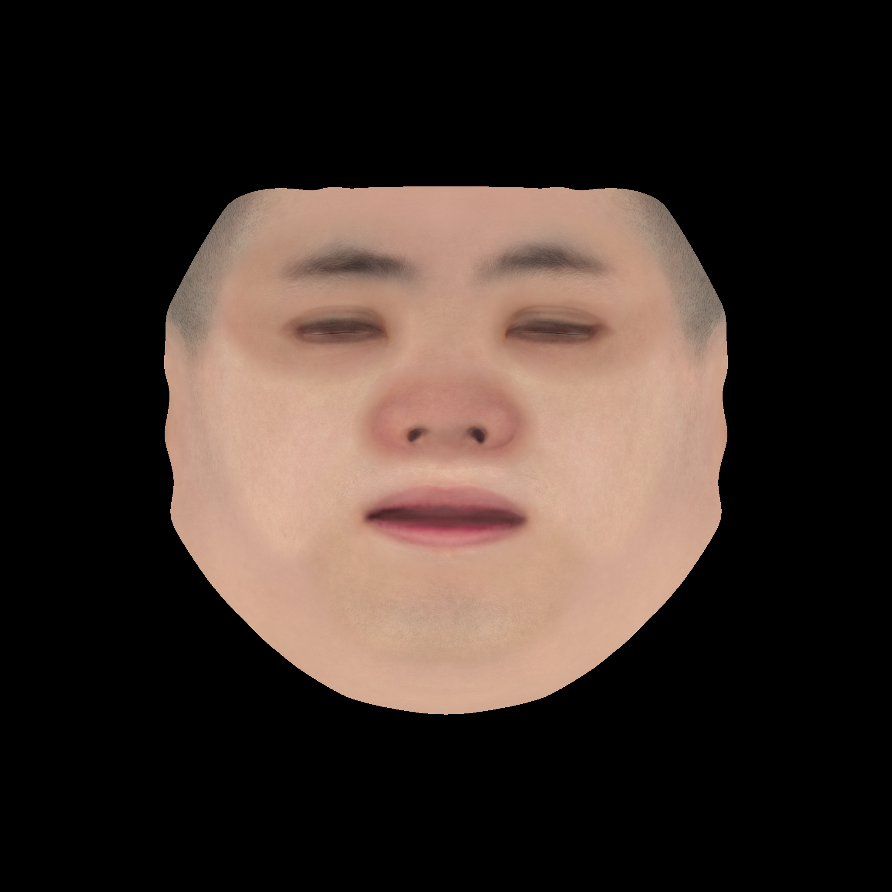
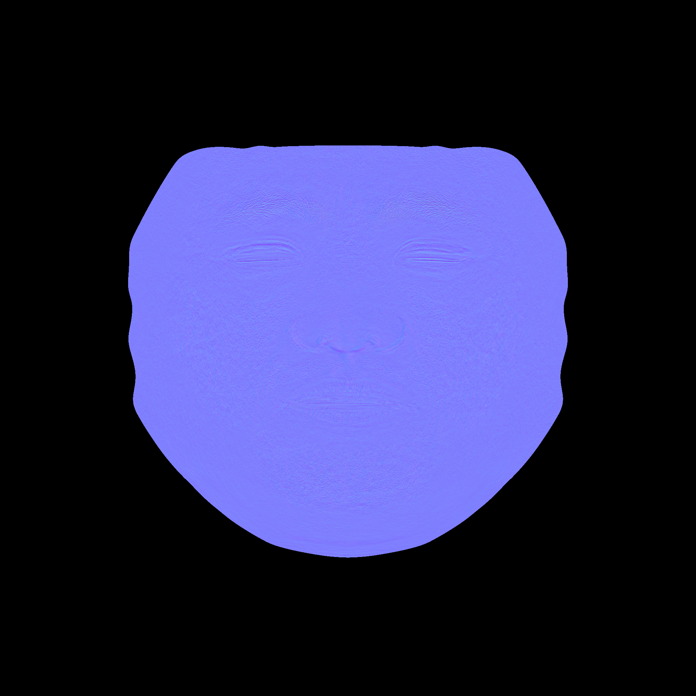
</p>
</div>

> Note: The randomly generated albedo/normal maps from regional pyramid bases contain severe artifacts due to separated regions. Our 3DMM fitting algorithm contains a smoothness loss to tackle the problem. 

<br>


## Contact

If you have any questions, please contact [Linchao Bao](https://linchaobao.github.io/).


## Citation

If you use the code or 3DMM provided in this repository, please cite our paper as follows.

```
@article{hifi3dface2021tencentailab,
  title={High-Fidelity 3D Digital Human Head Creation from RGB-D Selfies},
  author={Bao, Linchao and Lin, Xiangkai and Chen, Yajing and Zhang, Haoxian and Wang, Sheng and Zhe, Xuefei and Kang, Di and Huang, Haozhi and Jiang, Xinwei and Wang, Jue and Yu, Dong and Zhang, Zhengyou},
  journal={ACM Transactions on Graphics},
  year={2021}
}
```

