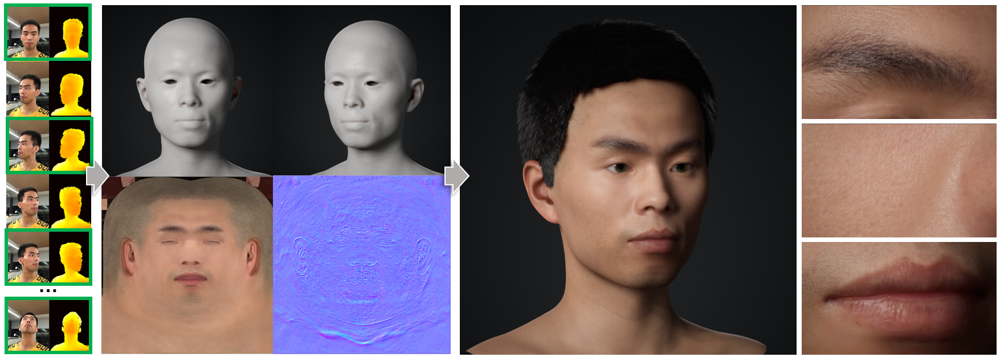
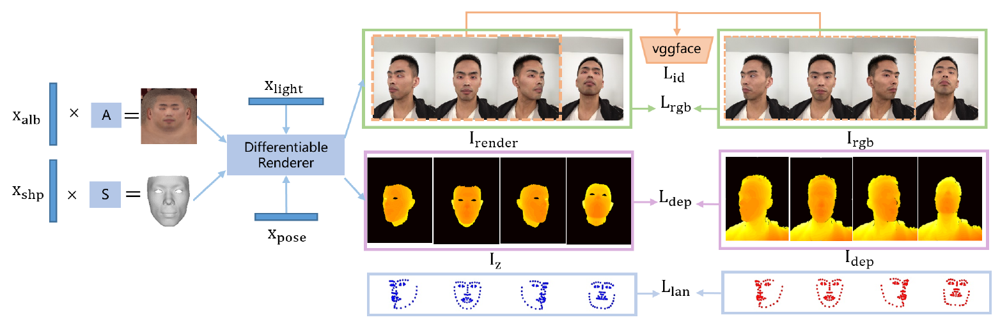
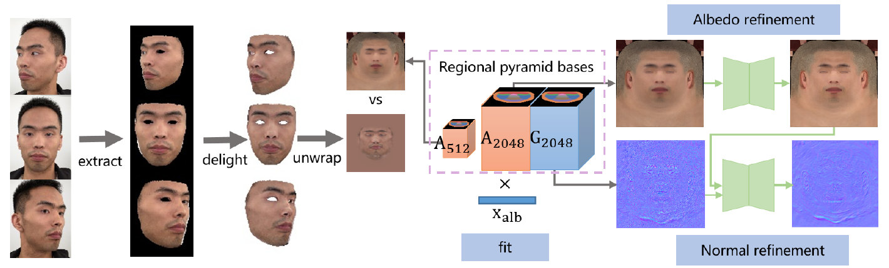
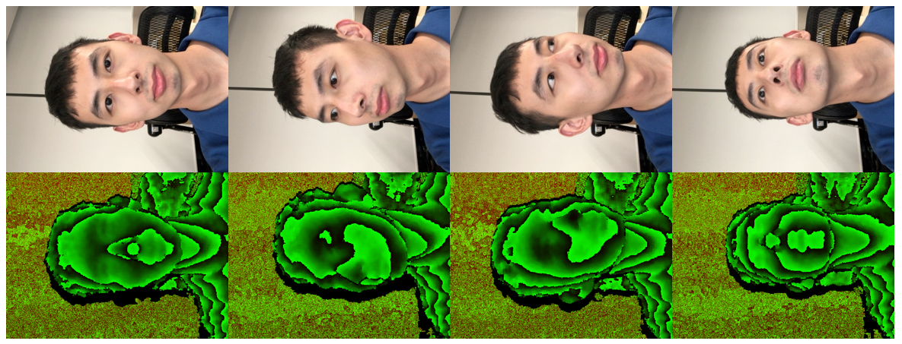
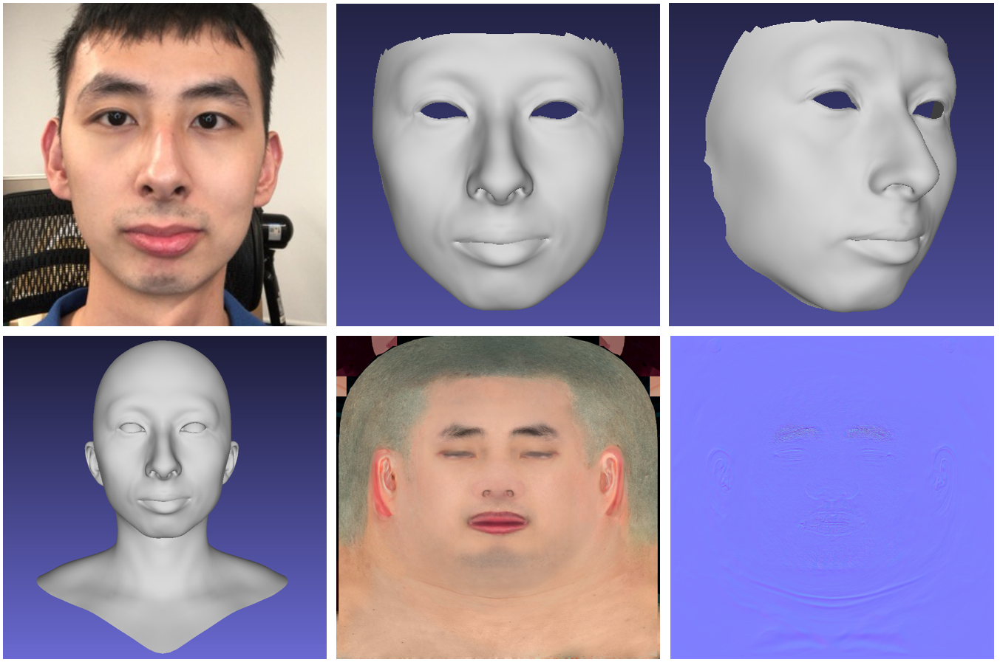
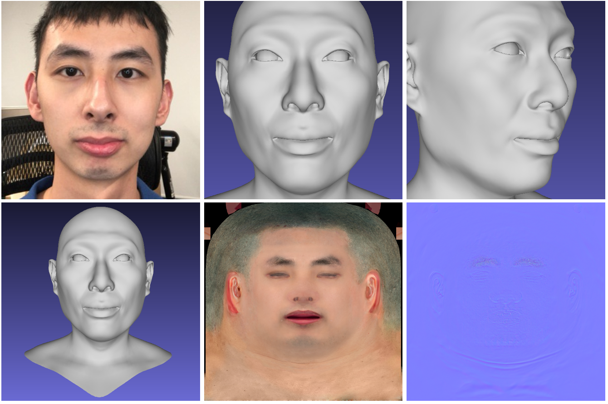
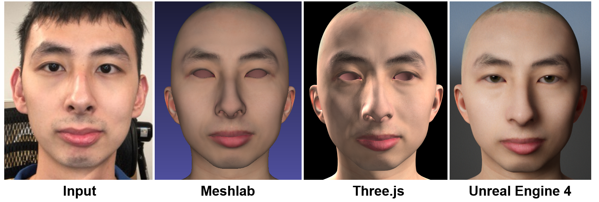

# High-Fidelity 3D Digital Human Creation from RGB-D Selfies


<div>
<div align=left>
</div>

<br>

This repository provides the python code and 3DMM of the following paper:

> **High-Fidelity 3D Digital Human Creation from RGB-D Selfies**.\
> Xiangkai Lin*, Yajing Chen*, Linchao Bao*, Haoxian Zhang, Sheng Wang, Xuefei Zhe, Xinwei Jiang, Jue Wang, Dong Yu, and Zhengyou Zhang. (*Equal contribution) \
> arXiv: https://arxiv.org/abs/2010.05562 \
> Project Page: https://tencent-ailab.github.io/hifi3dface_projpage/

> **Abstract**: *We present a fully automatic system that can produce high-fidelity, photo-realistic 3D digital human characters with a consumer RGB-D selfie camera. The system only needs the user to take a short selfie RGB-D video while rotating his/her head, and can produce a high quality reconstruction in less than 30 seconds. Our main contribution is a new facial geometry modeling and reflectance synthesis procedure that significantly improves the state-of-the-art. Specifically, given the input video a two-stage frame selection algorithm is first employed to select a few high-quality frames for reconstruction. A novel, differentiable renderer based 3D Morphable Model (3DMM) fitting method is then applied to recover facial geometries from multiview RGB-D data, which takes advantages of extensive data generation and perturbation. Our 3DMM has much larger expressive capacities than conventional 3DMM, allowing us to recover more accurate facial geometry using merely linear bases. For reflectance synthesis, we present a hybrid approach that combines parametric fitting and CNNs to synthesize high-resolution albedo/normal maps with realistic hair/pore/wrinkle details. Results show that our system can produce faithful 3D characters with extremely realistic details. Code and the constructed 3DMM is publicly available.*

**Note**: *Please note that the reported running time in the paper are obtained with our optimized C++ code but NOT the python code here. The python code in this repository is only for research purposes and not fully optimized.*

**Note**: Please visit the **./3DMM** folder for details about our 3DMM, namely **Tencent AI-NEXT 3D Face Model (East-Asian Version)**, in short **AI-NEXT Face Model (EAs)**.

## Disclaimer

*The code and data in this repository are for research purpose only. No representation or warranty whatsoever, expressed or implied, is made as to its accuracy, reliability or completeness. We assume no liability and are not responsible for any misuse or damage caused by the code and data. Your use of the code and data are subject to applicable laws and your use of them is at your own risk.*


<br>

<div>
<div align=left>
</div>

<div>
<div align=left>
</div>

<br>

## Directories

**3DMM**: \
    our constructed 3DMM from 200 high-fidelity East-Asian face models, see the README.md file inside the folder for more details. 

**data_prepare**:  \
    code for face detection, landmark detection and face segmentation to preprocess image and generate necessary information for 3DMM optimization. 

**optimization**: \
    3DMM optimization code for facial geometry modeling. 

**texture**:  \
    code for facial reflectance synthesis. 
    
**third_party**:  \
    code from the other repositories. 
    

## Prerequisites

- **Dependencies**
    - Linux
    - python 3.6
    - tensorflow 1.8 (also tested in tensorflow 1.15)
    - g++ 4.8 (other version might also work)

- **Installation**

    Please run the follow commands for installation.
    ```
    git clone https://github.com/tencent-ailab/hifi3dface.git
    cd hifi3dface
    bash install.sh
    ```
    The script in **install.sh** installs all packages required to run our code, and compiles the c++ kernel of the differentiable renderer provided by [tf_mesh_renderer](https://github.com/google/tf_mesh_renderer).
    Pay attention to finding the correct path to **TF_INC** and **TF_LIB**. The path specified in **install.sh** might not suit your case. If it does not work, please try to fix them manually. If your g++ version is greater than 4, please delete "-D_GLIBCXX_USE_CXX11_ABI=0" ( Line 9 ) in **install.sh**.
    You can also compile the code using the method provided by [**tf_mesh_renderer**](https://github.com/google/tf_mesh_renderer). 

- **Downloads**

    You will need to download the following files to run our code: 

    - Download our **3DMM** (5.4GB) and unzip it to the **./3DMM** floder: [Google Drive](https://drive.google.com/file/d/18BU5y5q3-MFJYARdSWLBjRBLKO1ZbrTH/view?usp=sharing), or [**腾讯微云**](https://share.weiyun.com/ByrUzsJG)
    - Download the **resources.zip** (2GB) into the repo root directory **./** and unzip it: [Google Drive](https://drive.google.com/file/d/1FoBbj1qWdf2LyJkxLYnMJ4h4woTQ6QL_/view?usp=sharing), or [**腾讯微云**](https://share.weiyun.com/Hgov20It)
    - Download the **test_data.zip** (80MB) into the repo root directory **./** and unzip it: [Google Drive](https://drive.google.com/file/d/1f5imMCO0ug_ozj0cDcNYtizom5lBu2PH/view?usp=sharing), or [**腾讯微云**](https://share.weiyun.com/5PCy1rID)


## Running The Code

### 1. RGBD Face Reconstruction 

To reproduce the results in our paper, please follow the steps provided below.


**1.1 Data acquisition:**

You may use our [RGBD data capture code](https://github.com/lxk121lalala/RGBD_data_capture) (need an iPhone with TrueDepth camera) to capture RGB-D selfies. The color and depth images are in JPG and PNG formats respectively. The resolution of the color image is 1504 x 1128, and the depth image is of size 640 x 480. If you want to use your own capturing system, please modify the code to suit your case. Below are example RGB-D images exported from our capturing app:
<div>
<div align=left>
</div>

**1.2 Configuration:**

Modify **run_rgbd.sh** as following:

1. Line 6: define the path to **3DMM** as where you download the 3DMM model. 
    ```bash
    basic_path=$(pwd)/3DMM/files/;
    ```
2. Line 7: define the path to **resources** as where you download the data. 
    ```bash
    resources_path=$(pwd)/resources/;
    ```
3. Line 24: define the path to **test data**. If you capture your own data, please specify the path to the video sequence or 4 pairs of (color, depth) images with different poses (mid-left-right-up).
    ```bash
    ROOT_DIR=$(pwd)/test_data/RGBD/test1/;
    ```
4. Line 23: define whether testing data is a video sequence. 
    ```bash
    is_only_four_frame="False" #  True for four frames, False for a video sequence
    ```
5. Line 121-136: configure optimization parameters.
    ```bash
    log_step=10
    learning_rate=0.05
    lr_decay_step=10
    lr_decay_rate=0.9
    photo_weight=100
    gray_photo_weight=80
    reg_shape_weight=0.4
    reg_tex_weight=0.0001
    depth_weight=1000
    id_weight=1.8
    real_86pt_lmk3d_weight=0.01
    lmk_struct_weight=0
    train_step=100
    is_fixed_pose="False"
    is_add_head_mirrow="False" #  True: output symmetrical head completion result
    is_add_head_male="True" #  True: complete head with a male template
    ```

**1.3 Run:**

Please run the follow command to generate the results.
```bash
bash run_opt_rgbd.sh
```

The RGBD data will be used for shape optimization and HD texture/normal maps generation. We highly recommend that you use our 3DMM version **AI-NExT-Shape.mat** in order to achieve the same results as reported in our paper. You can also run our code with **BFM**, but the texture map and normal map will not be generated if you use BFM, as BFM does not provide UV maps.

**1.4 Results:**

The produced results will be saved in the **results** floder in data path, including: 

    - head.obj: the final mesh file
    - albedo.png: the final albedo map file
    - normal.png: the final normal map file
    - test.mtl: a material description file for simple rendering in meshlab

An example of the resulting files is shown below. Note that the our 3DMM version **AI-NExT-Shape.mat** only contains face region, and our code consists of a head completion step. 

<div>
<div align=left>
</div>

<br>


### 2. RGB Face Reconstruction

Our code also supports RGB inputs without depth data, but **note** that running with only RGB inputs cannot achieve comparable reconstruction accuracy as RGBD inputs.

**2.1 Data acquisition:**
You may use one image or multiple images of the same person to run our code. Please note that all data of the same identity should be placed into the same folder.

**2.2 Configuration:**

Please modify **run_rgb.sh** as the following:

1. Line 6: define the path to **3DMM** as where you download the 3DMM model. 
  ```bash
  basic_path=$(pwd)/3DMM/files/;
  ```
2. Line 7: define the path to **resources**. 
  ```bash
  resources_path=$(pwd)/resources/;
  ```
3. Line 22: define the path to **test data**. You may also specify the path to your own input rgb data folder.
  ```bash
  ROOT_DIR=$(pwd)/test_data/RGB/test1/single_img/;
  ```
4. Line 54-70: configure optimization parameters.
  ```bash
  train_step=120
  log_step=20
  learning_rate=0.05
  lr_decay_step=20
  lr_decay_rate=0.9

  photo_weight=100.0
  gray_photo_weight=80.0
  reg_shape_weight=4.0
  reg_tex_weight=8.0
  id_weight=1.5
  real_86pt_lmk3d_weight=5.0
  real_68pt_lmk2d_weight=5.0
  lmk_struct_weight=0

  num_of_img=1 # The number of input images
  project_type="Pers" # Use "Pers" for selfie photos, and "Orth" for face photos captured in a far distance
  ```

**2.3 Run:**

Please run the follow command to generate the results.
```bash
bash run_opt_rgb.sh
```

Note that if you run the script with more than one images, only the first image would be used for generating the texture map and normal map. Besides, you can also run the code with **BFM**, but the texture map and normal map will not be generated in this case. We highly recommend that you use the our 3DMM version **AI-NExT-Shape-NoAug.mat** for the RGB inputs, as there are no reliable geometric constraints without depth data inputs. 


**2.4 Results:**
 
The produced results will be saved in the **results** floder in data path, including: 

    - head.obj: the final mesh file
    - albedo.png: the final albedo map file
    - normal.png: the final normal map file
    - test.mtl: a material description file for simple rendering in meshlab

An example of the resulting files is shown below. Note that the shape model obtained with **AI-NExT-Shape-NoAug.mat** is already a full head model. 
<div>
<div align=left>
</div>

<br>


### 3. Rendering

The produced mesh and albedo/normal map can be used to render a realistic digital human head in a physically based rendering engine like [Unreal Engine 4](https://docs.unrealengine.com/en-US/Resources/Showcases/DigitalHumans/index.html) (UE4). The results in our paper are rendered using UE4 engine, with the skin material settings the same as the [digital human rendering showcase "Mike"](https://docs.unrealengine.com/en-US/Resources/Showcases/DigitalHumans/index.html) provided by UE4. 

For simpler visualization, we here provide two other rendering ways as follows. 

  - **Rendering with Meshlab**: You can directly use [Meshlab](https://www.meshlab.net/) to open the obj file, with the mtl file in a same folder. Note that normal maps are not used in the rendering. 
  - **Rendering with Three.js**: Please follow the instructions in this repo(https://github.com/cyj907/simple-mesh-visualizer). Normal maps can be used for rendering in this way. 

The rendering results are as follows (eyeballs are attached in the UE4 rendering): 

<div>
<div align=left>
</div>

> Note: The renderings are with different lighting settings. The mesh and albedo/normal map are the same (from RGBD reconstruction) in the renderings. 

<br>


## Contact

If you have any questions, please contact [Linchao Bao](https://linchaobao.github.io/).


## Acknowledgement

Our code uses the code from the following repos. We thank them for providing the code.

- **tf_mesh_renderer**: [https://github.com/google/tf_mesh_renderer](https://github.com/google/tf_mesh_renderer)
- **vgg face**: [https://github.com/ZZUTK/Tensorflow-VGG-face](https://github.com/ZZUTK/Tensorflow-VGG-face)
- **pix2pix**: [https://github.com/affinelayer/pix2pix-tensorflow](https://github.com/affinelayer/pix2pix-tensorflow)
- **face segmentation**: [https://github.com/switchablenorms/CelebAMask-HQ](https://github.com/switchablenorms/CelebAMask-HQ)
- **N-ICP**: [https://github.com/charlienash/nricp](https://github.com/charlienash/nricp)


## Citation

If you use the code or 3DMM provided in this repository, please cite our paper as follows.

```
@article{hifi3dface2020tencentailab,
  title={High-Fidelity 3D Digital Human Creation from RGB-D Selfies},
  author={Lin, Xiangkai and Chen, Yajing and Bao, Linchao and Zhang, Haoxian and Wang, Sheng and Zhe, Xuefei and Jiang, Xinwei and Wang, Jue and Yu, Dong and Zhang, Zhengyou},
  journal={arXiv preprint arXiv:2010.05562},
  year={2020}
}
```

## License

```
MIT License

Copyright (c) [2020] [Tencent AI Lab]

Permission is hereby granted, free of charge, to any person obtaining a copy
of this software and associated documentation files (the "Software"), to deal
in the Software without restriction, including without limitation the rights
to use, copy, modify, merge, publish, distribute, sublicense, and/or sell
copies of the Software, and to permit persons to whom the Software is
furnished to do so, subject to the following conditions:

The above copyright notice and this permission notice shall be included in all
copies or substantial portions of the Software.

THE SOFTWARE IS PROVIDED "AS IS", WITHOUT WARRANTY OF ANY KIND, EXPRESS OR
IMPLIED, INCLUDING BUT NOT LIMITED TO THE WARRANTIES OF MERCHANTABILITY,
FITNESS FOR A PARTICULAR PURPOSE AND NONINFRINGEMENT. IN NO EVENT SHALL THE
AUTHORS OR COPYRIGHT HOLDERS BE LIABLE FOR ANY CLAIM, DAMAGES OR OTHER
LIABILITY, WHETHER IN AN ACTION OF CONTRACT, TORT OR OTHERWISE, ARISING FROM,
OUT OF OR IN CONNECTION WITH THE SOFTWARE OR THE USE OR OTHER DEALINGS IN THE
SOFTWARE.
```


